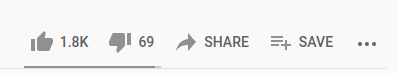

# QR Based Embedded YouTube URL
#### By *Walter Newsome* and *Joseph DiNiso*  
### How to Install:  
`pip3 install -r requirements.txt`

### How to create a label:  
To create a label, call 
`python3 create_label.py EMBEDDED_URL`    
Where `EMBEDDED_URL` is an embedded YouTube URL code. For example, calling  
`python3 create_label.py 8AHCfZTRGiI`  
will create a QR code URL for the song 'Hurt'.

To find the code for an embedded YouTube URL, click the **SHARE** button as seen here, and then  
copy all characters after **youtu.be/**  
  
### How to detect a label:  
To detect a label, call `python3 detect_label.py` and a webcam view should open up, hold a  
generated QR image to the webcam. The webcam will automatically detect the code and try to  
parse the stored data in the code. When correctly parsed, the program will automatically  
open the video in your default browser.

